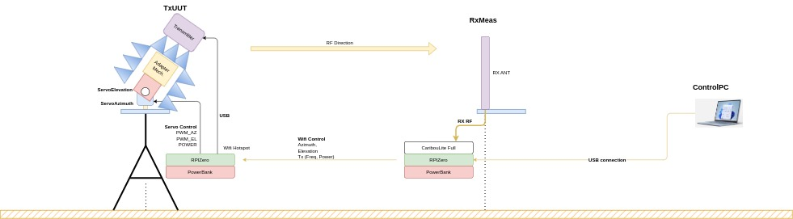

# CLAM
CaribouLabs antenna measurement(CLAM) is a tool desgined to test a signal strength in certain environment.
It is composed by three units:
 1. TxUUT - A unit desinged to transmit/stop transmission of signals and control a pan-tilt unit in order to decide transmission direction
 2. RxMeas - A unit desgined to receive the signals and compute the RSSI, it requires [CaribouLite](https://github.com/cariboulabs/cariboulite).
 3. ControlPC: Computer that controls the opertions of TxUUT and RxMeas, it is the only Unit that can communicate with both.
    <table>
    <tr>
        <td></td>
    </tr>
    <tr>
        <td style="text-align: center;">CLAM</td>
    </tr>
    </table>
## Requirements
CLAM required certain electronics for each unit and install modules:
### Electronics
#### TxUUT - 
1. RPi model 4B
2. RPi hat PCA9685.
3. Pan tilt unit. We used the following [unit](https://www.hiwonder.com/products/pan-tilt). Platform holding two LD-1501MG servo motors which moves pitch and azimuth angles 
4. Transmitter technologt - You must own signal transmission unit and adapt it to our interface.
#### RxMeas 
As we the TxUUt, we are using the RPi Zero 2 connected to a CaribouLite unit
  <table style="width: 80%; margin: auto; border-collapse: collapse;">
  <tr>
    <td></td>
  </tr>
  <tr>
    <td>CaribouLite on RPi</td>
  </tr>
</table>
1. ControlPC - Requires a Linux PC
    
### Requested libraries
1. Hostapd - Module allowing a device to become an Access point(AP). It will Configure the RxMeas to be Router.
2. Dnsmasq - Module provide network inconfiguration that support the AP creation of hostapd module.
3. Iptables - Module that enables control over incoming and outcoming network traffic.
4. protobuf - Module that allows to send protobuf messsage, will be explained in Communication.
5. For the python files you are need: Numpy, Matplotlib, seaborn, pandas, TOML, smbus
 
## Configuration & Installation
**Before we start, we remind you the TxUUT must have transmitter and CaribouLite must be installed on RxMeas**
### 1. Cloning CLAM
We clone the reopsitory to each unit

   ```
   git clone https://github.com/cariboulabs/CLAM.git
   ```
Then, we enter CLAM directory
```
cd CLAM
```

### 2. Network configuration
First, we configure the RPi of of RxMeas to be an AP. Download the net_conf.sh and run it.
```
chmod +x net_conf.sh
./net_conf.sh
```
After we configured the network of RxMeas we have to make sure the TxUUT and ControlPC are connected to RxMeas as they are rebooted.
We will edit wpa_supplicant.conf that manage wireless network connections 
   ```
   sudo nano /etc/wpa_supplicant/wpa_supplicant.conf
   ```
Then, we add to it the following configuration to the file:
   ```
   network=
   {
    ssid="CL_ANTPATTERN"
    psk="CaribouAntenna4321"
    key_mgmt=WPA-PSK
   }
   ```
We apply the changes by restarting the wpa_supplicant service:
   ```
   sudo systemctl restart wpa_supplicant
   ```
Finally we will reboot both devices
   ```
sudo reboot
   ```
To connect the TxUUT we will use the command:
```
sudo nmcli dev wifi connect "CL_ANTPATTERN" password "CaribouAntenna4321"
```
**Note: ** In case there is a problem with configuration process use the following [guide](https://gist.github.com/Cdaprod/c3eb1a65246625349c4ceed6e4e4135b) 
### 3. Configuration of devices
We will use the 'setup.sh' file to configure the program to start as system rebooting by the command and add required system parameter:
   ```
   chmod +x setup.sh
   ./setup.sh --system <system_name>
   ```
It will be one the three: ControlPC, TxUUT, RxMeas
**Configuration & Installation process has been completed.**

#### Communication:
We developed a communication process based on the UDP protocol and Protobuf messages:
1. UDPcommunicator:
The 'UDPcommunicator' is a class desgien in [Python](UDPcommunicator.py) and [C++](utils/UDPcommunicator.hpp).
Each class opens a UDP socket which allows us to send, receive and close the socket.

1. Protobuf
We will use protobuf message to communicate between systems
We have different messages, each with their own data and agenda: 'System', 'Inforamtion', 'Motors', 'Transmit', 'SetFrequency', 'Sampling' and 'GetRssi'
These methods are part of external module called 'ProtobufTransformer'([Python](utils/ProtobufTransformer.py), [C++](utils/ProtobufTransformer.hpp)).

**Add protobuf messages**
First, we go to Messages.proto in utils dir
```
cd utils
nano Messages.proto
```

1. We create another Message as in the same syntax
2. We add an Enum value to the new message in MessageType
3. Since we wrap each message in a spcieal Wrapper message we have to add it to the Wrapper message
4. Then we compile it again for python and C++
5. Now you have to edit ProtobufTransformer in both sides and the relative context to the different units
## 4. Units
### TxUUT:
The TxUUT is responsible to move the pan-tilt unit to the desiered location and transmit/stop transmission of signals. The module is written in [python](TxUUT/TxUUT.py)
1. Transmission:
Now, we must add transmitor software to:
```
self.transmitter = ... # Add your transmitter technology
```
The code must support three names:
1. connect - Method to connect transmitter to device
2. transmit - Method that require frequnecy, power, wave and bool to transmit or not
3. disconnect - Method to disconnect in transmitter technology when ending.
The transmitter interface was written in [Python](TxUUT/transmitter_interface.py)

**Warning:** You are required to know the legal frequncies, power, and wave types to transmit in your country. CaribouLabs will not be responsibe by any means for a breach of law.


## RxMeas:
The RxMeas unit will handle the signal receiving and RSSI calculations, it was developed in [C++](RxMeas/RxMeas.hpp)

## ControlPC:
The main unit to control the operations of the CLAM, developed in [python](ControlPC/ControlPC.py).
It is configured by TOML file and the results will uploaded into CSV file.
Results will be analyzed and provides 3D measurement plot and heatmap plot.

## Activation

As the services are ready, we go to the Control PC and activate the ControlPC

```cd ControlPC
   python3 main.py
```
We will have CLI interface we will your actions, you must activate the unit and check communication with them using option 1

Using option 5 will allow us to scan certain area depend on Configurations in TOML file "Conf_ControlPC.toml"
Don't try put azimuth bigger then 90 degrees, it will mess with the system observation of the upper hemosphere!.

Once the scanning is complete we will receive CSV file with results and heatmap plot. We add antenna pattern plot and 3d plot in plotter.py if needed.


